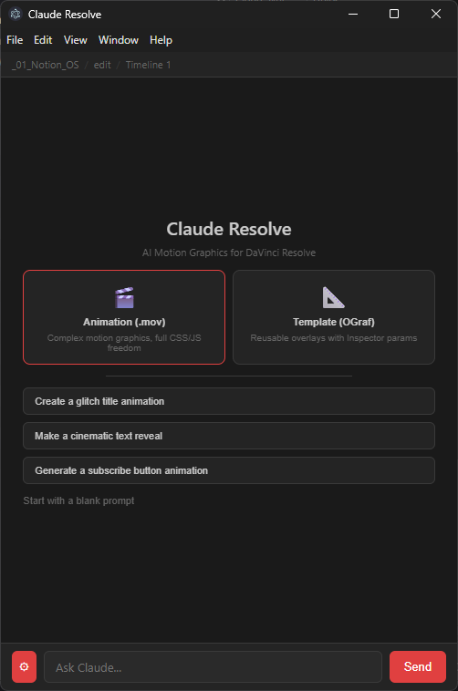
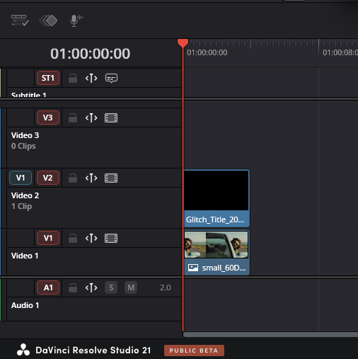

# Claude Resolve (Beta)

**AI Motion Graphics Generator for DaVinci Resolve Studio**
*by Oleg Kupshukov*

Claude Resolve is a Workflow Integration Plugin that brings AI-powered motion graphics generation directly into DaVinci Resolve Studio. Describe what you want in plain text, and Claude generates the animation code, renders it to ProRes 4444 with alpha transparency, and imports it to your timeline. Supports two modes: one-off .mov renders and reusable OGraf templates with Inspector parameters.






## Requirements

- **DaVinci Resolve Studio 21+** (not the free version — Workflow Integration Plugins require Studio)
- **Claude Code CLI** with an active Pro or Max subscription
- **Python 3.10+** with Playwright installed
- **ffmpeg** in PATH
- **Windows** (macOS support planned)

## Installation

1. Install Claude Code CLI:
   ```
   npm install -g @anthropic-ai/claude-code
   ```

2. Log in to Claude Code:
   ```
   claude login
   ```

3. Install Python dependencies:
   ```
   pip install playwright
   playwright install chromium
   ```

4. Make sure ffmpeg is in your PATH.

5. Copy the plugin folder to the Resolve plugins directory:
   ```
   xcopy /E /I plugin "C:\ProgramData\Blackmagic Design\DaVinci Resolve\Support\Workflow Integration Plugins\com.clauderesolve.plugin"
   ```

6. Copy the renderer:
   ```
   xcopy /E /I renderer "C:\ProgramData\Blackmagic Design\DaVinci Resolve\Support\Workflow Integration Plugins\com.clauderesolve.plugin\renderer"
   ```

7. Restart DaVinci Resolve. Open the plugin from **Workspace > Workflow Integration > Claude Resolve**.

## Usage

1. Open the plugin in DaVinci Resolve
2. Select a mode: **Animation (.mov)** or **Template (OGraf)**
3. Type a prompt describing the motion graphic you want
4. Preview the result in the built-in player
5. Click **Render .mov** or **Install** to use it in your project

## Two Modes

### Animation (.mov)

Generates one-off HTML animations rendered frame-by-frame to ProRes 4444 .mov with alpha transparency via Playwright + ffmpeg. Full creative freedom: CSS animations, SVG, Canvas, filters, blur, backdrop-filter. The rendered .mov is automatically imported to your current timeline.

**Use when:** you need a specific animation for this project — title cards, text reveals, glitch effects, lower thirds, transitions.

### Template (OGraf)

Generates reusable OGraf Web Component templates that appear in Resolve's Effects Library under **Titles > HTML Titles > ClaudeResolve**. Templates expose parameters in the Inspector panel (text, colors, sizes, timing) so you can customize them without code.

**Use when:** you want reusable overlays you'll apply across multiple projects — branded lower thirds, countdown timers, social media overlays.

## Settings

Open the sidebar (gear icon) to configure:

- **Model**: Sonnet (fast) or Opus (smart)
- **Mode**: Switch between .mov and OGraf (restarts Claude session)
- **FPS**: 24, 25, 30, or 60
- **Resolution**: 1920x1080 or 3840x2160
- **Assets**: Manage installed templates and rendered .mov files

## Known Limitations

- Complex prompts may be slow on Sonnet — switch to Opus for better results on detailed animations
- OGraf templates require a Resolve restart to appear in the Effects Library
- OGraf templates use CPU rendering on Windows (may cause brief flickering during preview)
- Windows only for now
- The plugin spawns Claude Code CLI as a subprocess — first response may take a few seconds to warm up

## Links

- [GitHub](https://github.com/olegkupshukov/claude-resolve)
- [Instagram](https://instagram.com/olegkupshukov)

## License

MIT License. See [LICENSE](LICENSE) for details.

## Built With

- [Claude Code](https://claude.ai/claude-code) — AI engine
- [DaVinci Resolve Scripting API](https://www.blackmagicdesign.com/products/davinciresolve) — Resolve integration
- [React](https://react.dev) — Plugin UI
- [Playwright](https://playwright.dev) — Frame-perfect rendering
- [ffmpeg](https://ffmpeg.org) — ProRes 4444 encoding
