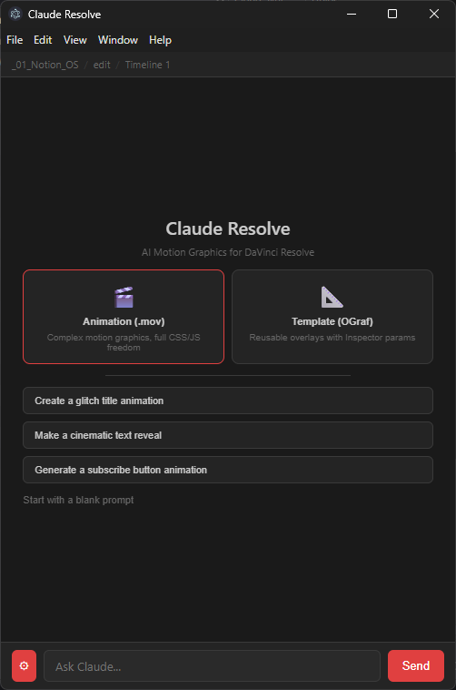

# Claude Resolve (v0.5.5-beta)

**AI Motion Graphics Generator for DaVinci Resolve Studio**
*by Oleg Kupshukov*

Claude Resolve is a Workflow Integration Plugin that brings AI-powered motion graphics generation directly into DaVinci Resolve Studio. Describe what you want in plain text, and Claude generates the animation code, renders it to ProRes 4444 with alpha transparency, and imports it to your timeline.




## Requirements

- **DaVinci Resolve Studio** — the free edition can't load Workflow Integration Plugins, so Studio is required. Built and tested against **Studio 21**; the installer confirms Resolve is present but does not check its version, so 19/20 Studio may work (untested).
- **Claude Code CLI**, signed in with an active **Pro or Max** plan. The plugin authenticates through the CLI's own login (`claude login`) — it never uses or stores an API key.
- **Node.js 18+** — the Claude Code CLI runs on Node (used during install, and at runtime to generate animations). Frame rendering runs on Resolve's bundled Electron, so it needs no separate system Node.
- **ffmpeg** — a separate tool, not bundled. The installer auto-installs it (winget on Windows, Homebrew on macOS) and verifies it runs; if neither package manager is available it finishes with the exact command to run. Rendering needs it.
- **Windows** or **macOS**

The installer auto-installs Node, the Claude Code CLI, Playwright Chromium, and ffmpeg when they're missing, then verifies all four and ends with a clear summary of anything left to fix — see [Installation](#installation). For step-by-step setup and fixes, see [docs/INSTALL.md](docs/INSTALL.md).

## Installation

### Windows
1. Download or clone the repo
2. Double-click `install.bat`
3. Restart DaVinci Resolve

### macOS
1. Download or clone the repo
2. Double-click `install.command`
   - **"unidentified developer"?** Right-click `install.command` → **Open**, then confirm.
   - **Double-click does nothing / "permission denied"?** A ZIP download strips the executable bit. Open Terminal in the repo folder and run `bash install.command` (it restores the bit), or `chmod +x install.command`.
   - **Still blocked by Gatekeeper?** Clear the quarantine flag in the repo folder: `xattr -dr com.apple.quarantine .`
3. Restart DaVinci Resolve

The installer checks for DaVinci Resolve and Node.js, installs the Claude Code CLI and the renderer's dependencies (Playwright + Chromium), and copies the plugin into Resolve. After installing, open the plugin from **Workspace > Workflow Integration > Claude Resolve**.

## Usage

1. Open the plugin in DaVinci Resolve
2. Type a prompt describing the motion graphic you want
3. Preview the result in the built-in player
4. Click **Render .mov** to render it and import it to your timeline

## How it works

Generates one-off HTML animations rendered frame-by-frame to ProRes 4444 .mov with alpha transparency via Playwright + ffmpeg. Full creative freedom: CSS animations, SVG, Canvas, filters, blur, backdrop-filter. The rendered .mov is automatically imported to your current timeline on an empty track at the playhead position.

**Use it for:** title cards, text reveals, glitch effects, lower thirds, transitions — any specific animation for the project at hand.

## Settings

Open the sidebar (gear icon) to configure:

- **Model**: Sonnet (fast) or Opus (smart)
- **FPS**: 24, 25, 30, or 60
- **Resolution**: 1920×1080, 3840×2160, 1080×1920, 1080×1350, or 1080×1080
- **Assets**: Manage rendered .mov files (sync to Media Pool, delete)

## Bundled Fonts

The plugin ships with a curated set of fonts so generated animations look consistent across machines without extra installs:

- **Bricolage Grotesque**
- **Fraunces**
- **JetBrains Mono**

## Known Limitations

- Complex prompts may be slow on Sonnet — switch to Opus for better results on detailed animations
- The plugin spawns Claude Code CLI as a subprocess — first response may take a few seconds to warm up
- This is a beta — expect rough edges; please report issues on GitHub or Discord

Tested on Windows and macOS (Apple Silicon).

## Troubleshooting

**Windows: the installer hangs or fails at "Downloading Playwright Chromium."**
Antivirus — usually Windows Defender — can block Chromium while it extracts. Add the browser-cache folder to your exclusions, then re-run the install:
1. **Settings → Privacy & security → Virus & threat protection → Manage settings → Add or remove exclusions**, and add the folder `%LOCALAPPDATA%\ms-playwright`.
2. Re-run `install.bat`. To retry just this step manually:
   ```
   set PLAYWRIGHT_BROWSERS_PATH=%LOCALAPPDATA%\ms-playwright
   cd plugin\renderer
   npx playwright install chromium
   ```

**Rendering fails with "FFmpeg failed to spawn."**
ffmpeg isn't installed or isn't on `PATH`. Install it — `winget install Gyan.FFmpeg` (Windows) or `brew install ffmpeg` (macOS) — then reopen Resolve. Verify with `ffmpeg -version`.

**The plugin doesn't appear in Resolve.**
Fully quit and reopen Resolve, then look under **Workspace > Workflow Integration > Claude Resolve**. Confirm the plugin copied to:
- Windows: `%ProgramData%\Blackmagic Design\DaVinci Resolve\Support\Workflow Integration Plugins\com.clauderesolve.plugin`
- macOS: `/Library/Application Support/Blackmagic Design/DaVinci Resolve/Workflow Integration Plugins/com.clauderesolve.plugin`

**"Claude Code is not logged in."**
Run `claude login` in a terminal (or use the plugin's login button) and complete the browser sign-in with your Pro or Max account.

## Links

- [GitHub](https://github.com/olegkupshukov/claude-resolve)
- [Discord](https://discord.gg/95YrCyMgsK)
- [Instagram](https://instagram.com/olegkupshukov)

## License

MIT License. See [LICENSE](LICENSE) for details.

## Built With

- [Claude Code](https://claude.ai/claude-code) — AI engine
- [DaVinci Resolve Scripting API](https://www.blackmagicdesign.com/products/davinciresolve) — Resolve integration
- [React](https://react.dev) — Plugin UI
- [Playwright](https://playwright.dev) — Frame-perfect rendering
- [ffmpeg](https://ffmpeg.org) — ProRes 4444 encoding
